---
## Front matter
lang: ru-RU
title: Лабораторная работа 1
subtitle: Введение в Mininet
author:
  - Ланцова Я. И.
institute:
  - Российский университет дружбы народов, Москва, Россия

## i18n babel
babel-lang: russian
babel-otherlangs: english

## Formatting pdf
toc: false
toc-title: Содержание
slide_level: 2
aspectratio: 169
section-titles: true
theme: metropolis
header-includes:
 - \metroset{progressbar=frametitle,sectionpage=progressbar,numbering=fraction}
 - \usepackage{fontspec}
 - \usepackage{polyglossia}
 - \setmainlanguage{russian}
 - \setotherlanguage{english}
 - \newfontfamily\cyrillicfont{Arial}
 - \newfontfamily\cyrillicfontsf{Arial}
 - \newfontfamily\cyrillicfonttt{Arial}
 - \setmainfont{Arial}
 - \setsansfont{Arial}
---

# Информация

## Докладчик

:::::::::::::: {.columns align=center}
::: {.column width="70%"}

  * Ланцова Яна Игоревна
  * студентка
  * Российский университет дружбы народов

:::
::::::::::::::

## Цель работы

Основной целью работы является развёртывание в системе виртуализации (например, в VirtualBox) mininet, знакомство с основными командами для работы с Mininet через командную строку и через графический интерфейс.

# Выполнение лабораторной работы

## Выполнение лабораторной работы

{#fig:001 width=50%}

## Выполнение лабораторной работы

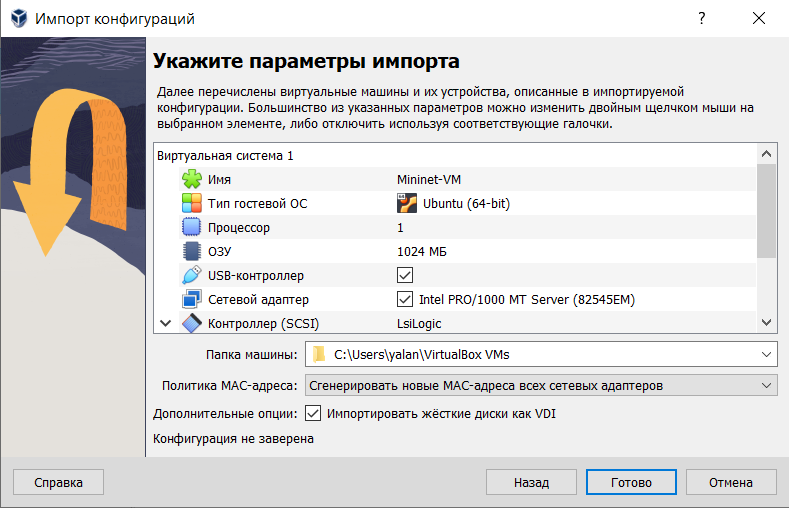{#fig:002 width=50%}

## Выполнение лабораторной работы

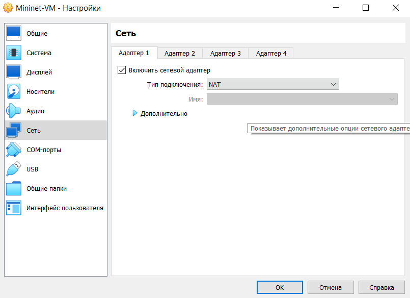{#fig:003 width=50%}

## Выполнение лабораторной работы

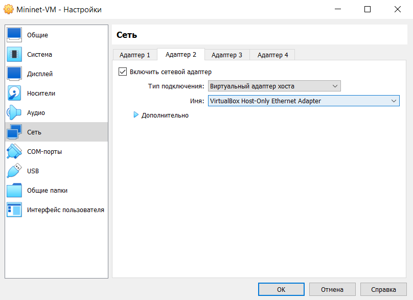{#fig:004 width=50%}

## Выполнение лабораторной работы

{#fig:005 width=50%}

## Выполнение лабораторной работы

{#fig:006 width=50%}

## Выполнение лабораторной работы

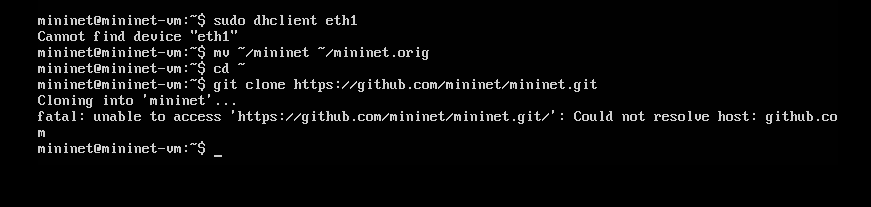{#fig:007 width=60%}

## Выполнение лабораторной работы

{#fig:008 width=50%}

## Выполнение лабораторной работы

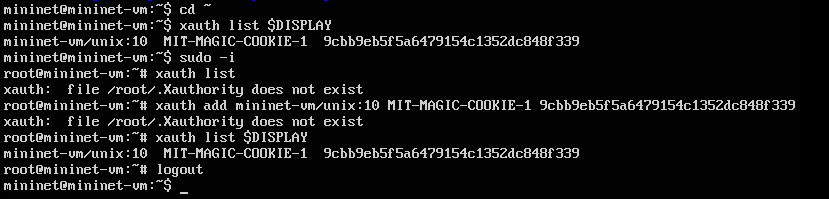{#fig:009 width=60%}

## Выполнение лабораторной работы

{#fig:010 width=50%}

## Выполнение лабораторной работы

{#fig:011 width=50%}

## Выполнение лабораторной работы

{#fig:012 width=50%}

## Выполнение лабораторной работы

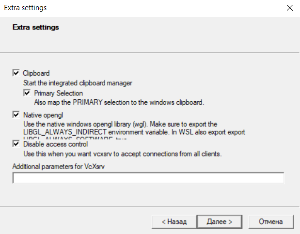{#fig:013 width=50%}

## Выполнение лабораторной работы

{#fig:014 width=60%}

## Выполнение лабораторной работы

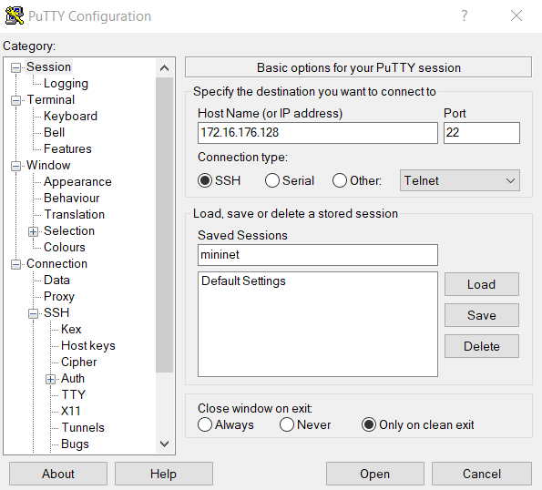{#fig:015 width=50%}

## Выполнение лабораторной работы

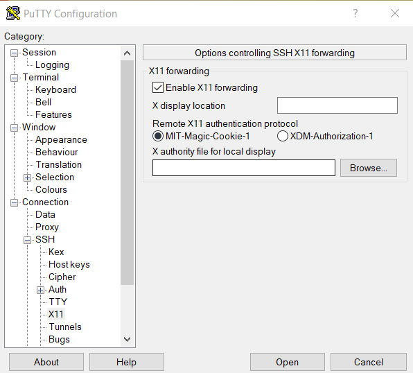{#fig:016 width=50%}

## Выполнение лабораторной работы

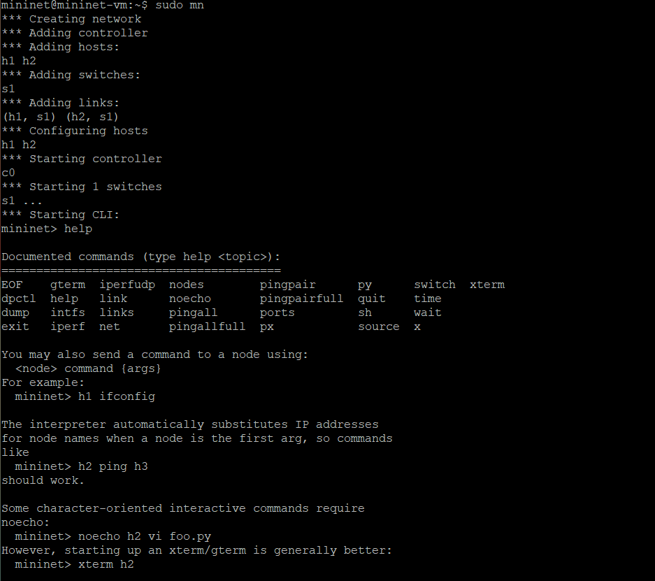{#fig:017 width=50%}

## Выполнение лабораторной работы

{#fig:018 width=70%}

## Выполнение лабораторной работы

{#fig:019 width=60%}

## Выполнение лабораторной работы

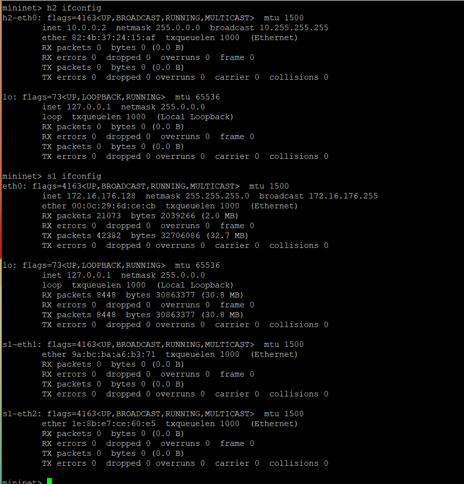{#fig:020 width=50%}

## Выполнение лабораторной работы

{#fig:021 width=60%}

## Выполнение лабораторной работы

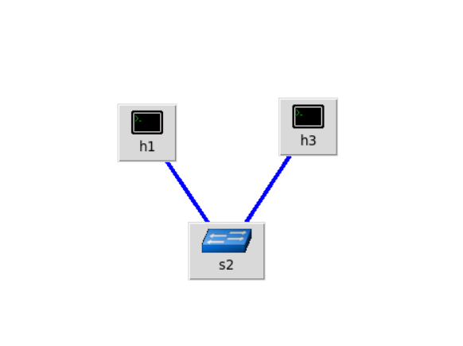{#fig:022 width=50%}

## Выполнение лабораторной работы

{#fig:023 width=50%}

## Выполнение лабораторной работы

{#fig:024 width=50%}

## Выполнение лабораторной работы

{#fig:025 width=50%}

## Выполнение лабораторной работы

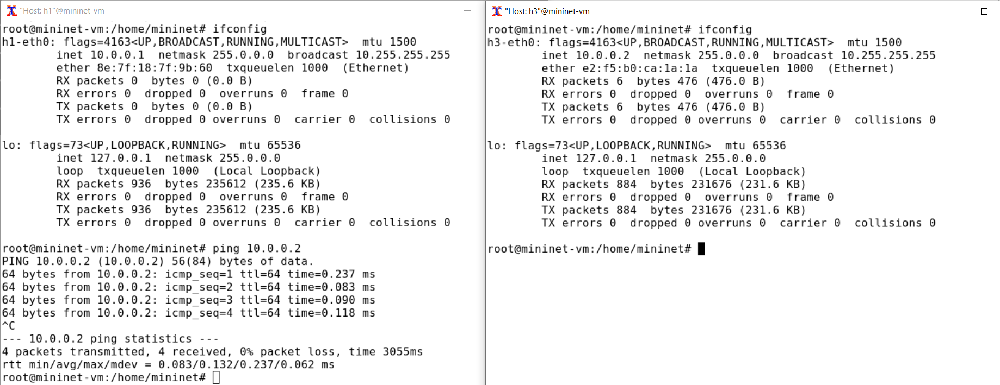{#fig:026 width=50%}

## Выполнение лабораторной работы

{#fig:027 width=50%}

## Выполнение лабораторной работы

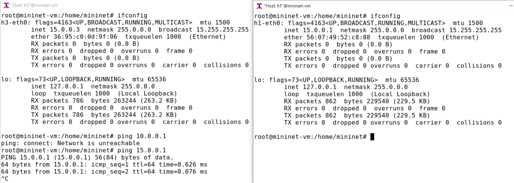{#fig:028 width=50%}

## Выполнение лабораторной работы

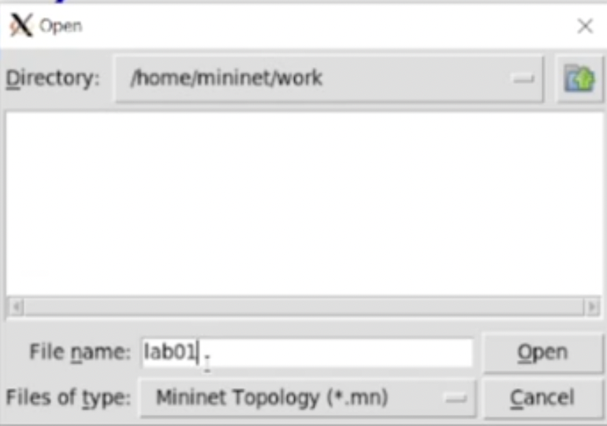{#fig:029 width=50%}

# Выводы

В результате выполнения данной лабораторной работы я развёрнула mininet в системе виртуализации VirtualBox, а также ознакомилась с основными командами для работы с Mininet через командную строку и через графический интерфейс.
