---
## Front matter
title: "Лабораторная работа №1"
subtitle: "Введение в Mininet"
author: "Ланцова Яна Игоревна"

## Generic otions
lang: ru-RU
toc-title: "Содержание"

## Bibliography
bibliography: bib/cite.bib
csl: pandoc/csl/gost-r-7-0-5-2008-numeric.csl

## Pdf output format
toc: true # Table of contents
toc-depth: 2
lof: true # List of figures
lot: true # List of tables
fontsize: 12pt
linestretch: 1.5
papersize: a4
documentclass: scrreprt
## I18n polyglossia
polyglossia-lang:
  name: russian
  options:
    - spelling=modern
    - babelshorthands=true
polyglossia-otherlangs:
  name: english
## I18n babel
babel-lang: russian
babel-otherlangs: english
## Fonts
mainfont: IBM Plex Serif
romanfont: IBM Plex Serif
sansfont: IBM Plex Sans
monofont: IBM Plex Mono
mathfont: STIX Two Math
mainfontoptions: Ligatures=Common,Ligatures=TeX,Scale=0.94
romanfontoptions: Ligatures=Common,Ligatures=TeX,Scale=0.94
sansfontoptions: Ligatures=Common,Ligatures=TeX,Scale=MatchLowercase,Scale=0.94
monofontoptions: Scale=MatchLowercase,Scale=0.94,FakeStretch=0.9
mathfontoptions:
## Biblatex
biblatex: true
biblio-style: "gost-numeric"
biblatexoptions:
  - parentracker=true
  - backend=biber
  - hyperref=auto
  - language=auto
  - autolang=other*
  - citestyle=gost-numeric
## Pandoc-crossref LaTeX customization
figureTitle: "Рис."
tableTitle: "Таблица"
listingTitle: "Листинг"
lofTitle: "Список иллюстраций"
lotTitle: "Список таблиц"
lolTitle: "Листинги"
## Misc options
indent: true
header-includes:
  - \usepackage{indentfirst}
  - \usepackage{float} # keep figures where there are in the text
  - \floatplacement{figure}{H} # keep figures where there are in the text
---

# Цель работы

Основной целью работы является развёртывание в системе виртуализации (например, в VirtualBox) mininet, знакомство с основными командами для работы с Mininet через командную строку и через графический интерфейс.

# Выполнение лабораторной работы

Перейдем в репозиторий Mininet, скачаем актуальный релиз ovf-образа виртуальной машины.
Запустим систему виртуализации и импортируем файл .ovf и укажем параметры импорта (рис. [-@fig:001];[-@fig:002]).

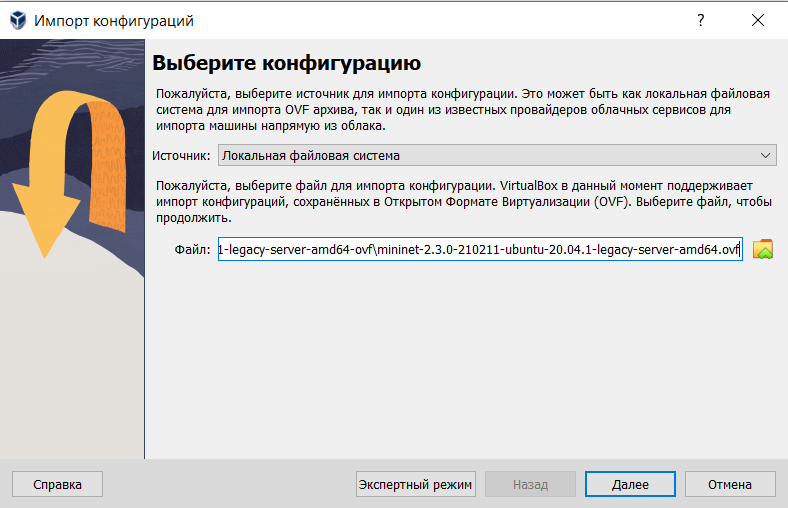{#fig:001 width=70%}

{#fig:002 width=70%}

Перейдем в настройки системы виртуализации и уточним параметры настройки виртуальной машины. Для VirtualBox (однако, я была вынуждения перейти на VMware, посокльку не могла пропинговать адрес своей машины впоследствии) выберем импортированную виртуальную машину и перейдите в меню "Машина -> Настроить". Перейдем к опции «Система». Если внизу этого окна есть сообщение об обнаружении неправильных настроек, то, следуя рекомендациям, внесем исправления (изменим тип графического контроллера на рекомендуемый). В настройках сети первый адаптер должен иметь подключение типа NAT (рис. [-@fig:003]). Для второго адаптера укажите тип подключения host-only network adapter (виртуальный адаптер хоста), который в дальнейшем вы будете использовать для входа в образ виртуальной машины (рис. [-@fig:004]).

{#fig:003 width=70%}

{#fig:004 width=70%}

Посмотрим адрес машины с помощью `ifconfig` (рис. [-@fig:005]).

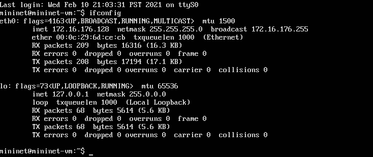{#fig:005 width=70%}

Подключимся к виртуальной машине (из терминала хостовой машины). Настроем ssh-подсоединение по ключу к виртуальной машине. Вновь подключимся к виртуальной машине и убедимся, что подсоединение происходит успешно и без ввода пароля (рис. [-@fig:006]).

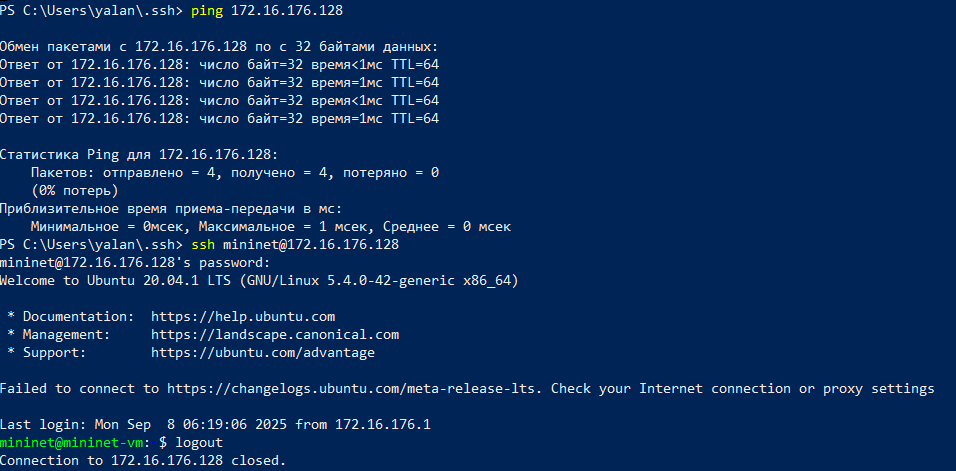{#fig:006 width=70%}

Активируем второй интерфейс для доступа к сети интернет (рис. [-@fig:007]). Поскольку я выполняла работу на VMware, у меня не получилось активировать интерфейс и подключиться к интернету с виртуальной машины, а следовательно установить mc и скачать новую версию mininet. 

{#fig:007 width=70%}

По умолчанию XTerm использует растровые шрифты малого кегля. Для увеличения размера шрифта и применения векторных шрифтов вместо растровых внесем изменения в файл `/etc/X11/app-defaults/XTerm`:

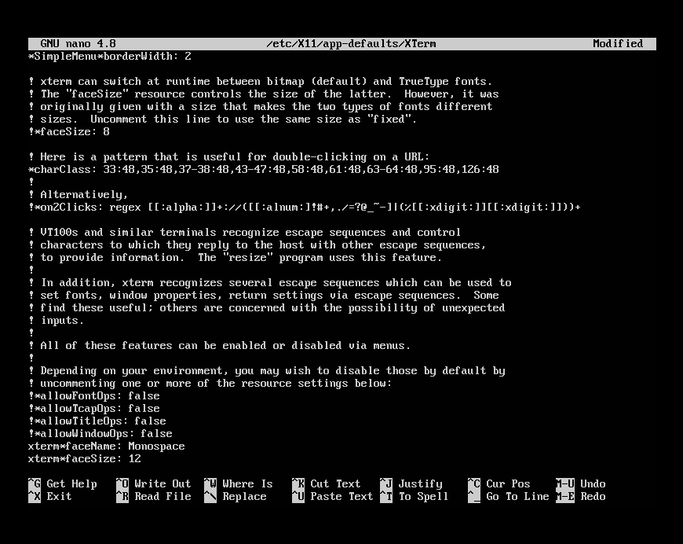{#fig:008 width=70%}

При попытке запуска приложения из-под суперпользователя возникает ошибка: `X11 connection rejected because of wrong authentication`. Ошибка возникает из-за того, что X-соединение выполняется от имени пользователя mininet, а приложение запускается от имени пользователя root с использованием sudo. Для исправления этой ситуации необходимо заполнить файл полномочий /root/.Xauthority, используя утилиту xauth. Скопируем значение куки (MIT magic cookie)1 пользователя mininet в файл для пользователя root(рис. [-@fig:009]).

{#fig:009 width=70%}

Для работы с Mininet из-под Windows необходимо установить putty и VcXsrv Windows X Server (рис. [-@fig:010]):

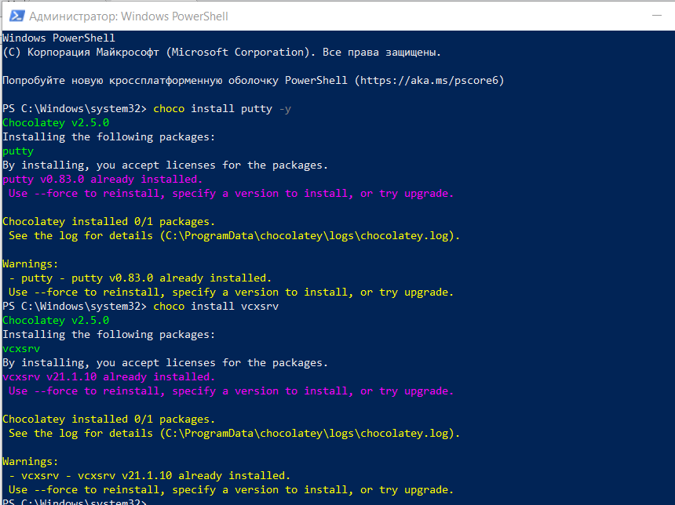{#fig:010 width=70%}

Далее запустим Xlaunch и выберем следующие опции(рис. [-@fig:011]-[-@fig:013]).

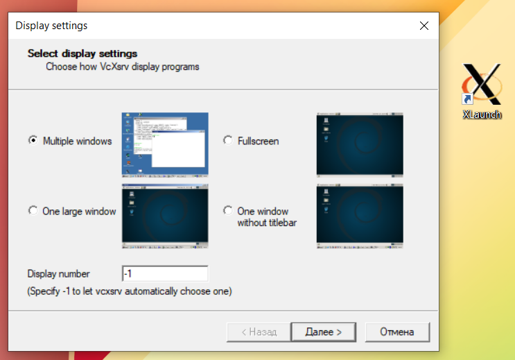{#fig:011 width=70%}

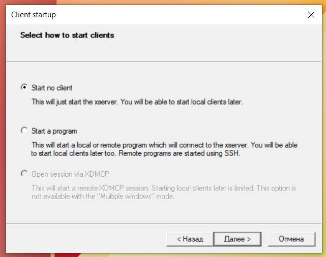{#fig:012 width=70%}

{#fig:013 width=70%}

Проверим, что XServer запустился через диспетчер задач (рис. [-@fig:014]):

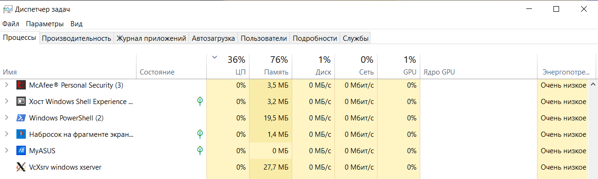{#fig:014 width=70%}

Запустим Putty, введем адрес нашей машины и включим нужные опции (рис. [-@fig:015], [-@fig:016]):

{#fig:015 width=70%}

{#fig:016 width=70%}

Для запуска минимальной топологии введем в командной строке (рис. [-@fig:017]): `sudo mn`. Эта команда запускает Mininet с минимальной топологией, состоящей из коммутатора, подключённого к двум хостам. Для отображения списка команд интерфейса командной строки Mininet и примеров их использования введем команду в интерфейсе командной строки Mininet: `help`

{#fig:017 width=70%}

Для отображения доступных узлов введем: `nodes` (рис. [-@fig:018]). Вывод этой команды показывает, что есть два хоста (хост h1 и хост h2) и коммутатор (s1). Иногда бывает полезно отобразить связи между устройствами в Mininet, чтобы понять топологию. Введем команду net в интерфейсе командной строки Mininet, чтобы просмотреть доступные линки: `net`. Вывод этой команды показывает:

- Хост h1 подключён через свой сетевой интерфейс h1-eth0 к коммутатору на интерфейсе s1-eth1.
- Хост h2 подключён через свой сетевой интерфейс h2-eth0 к коммутатору на интерфейсе s1-eth2.
- Коммутатор s1:
  - имеет петлевой интерфейс lo.
  - подключается к h1-eth0 через интерфейс s1-eth1.
  - подключается к h2-eth0 через интерфейс s1-eth2.
  
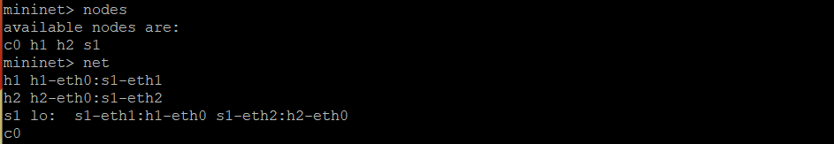{#fig:018 width=70%}
  
Mininet позволяет выполнять команды на конкретном устройстве. Чтобы выполнить команду для определенного узла, необходимо сначала указать устройство, а затем команду, например: `h1 ifconfig` (рис. [-@fig:019]). Эта запись выполняет команду ifconfig на хосте h1 и показывает интерфейсы хоста h1 — хост h1 имеет интерфейс h1-eth0, настроенный с IP-адресом 10.0.0.1, и другой интерфейс lo, настроенный с IP-адресом 127.0.0.1.

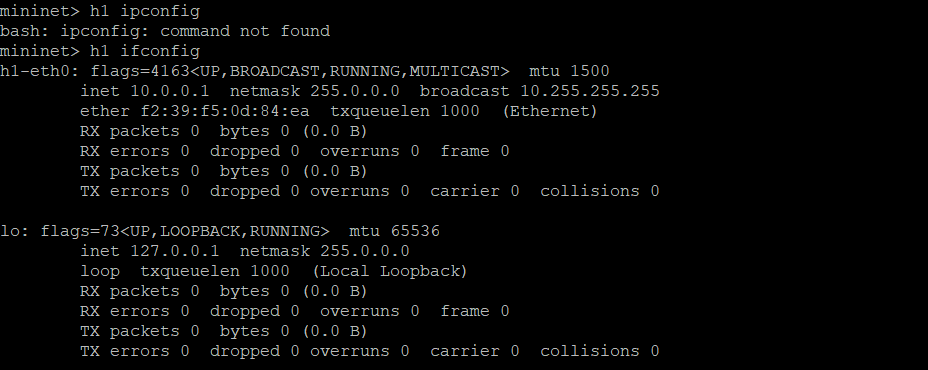{#fig:019 width=70%}
  
Посмотрим конфигурацию всех узлов (рис. [-@fig:020]).

{#fig:020 width=70%}

По умолчанию узлам h1 и h2 назначаются IP-адреса 10.0.0.1/8 и 10.0.0.2/8 соответственно. Чтобы проверить связь между ними, используем команду `ping` (рис. [-@fig:021]).

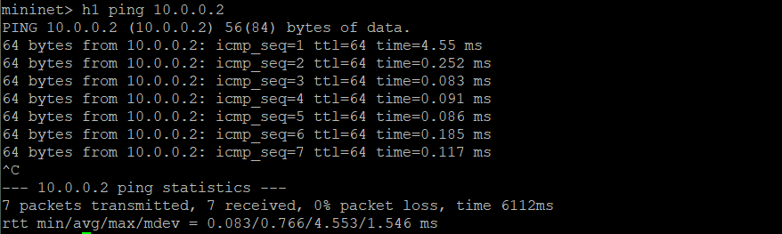{#fig:021 width=70%}

В терминале виртуальной машины mininet запустим MiniEdit. Добавим два хоста и один коммутатор, соединим хосты с коммутатором (рис. [-@fig:022]):

{#fig:022 width=70%}

Настроим IP-адрес на хостах h1 и h2. Для первого хоста укажем IP-адрес 10.0.0.1/8, а для хоста второго — 10.0.0.2/8(рис. [-@fig:023], [-@fig:024]).

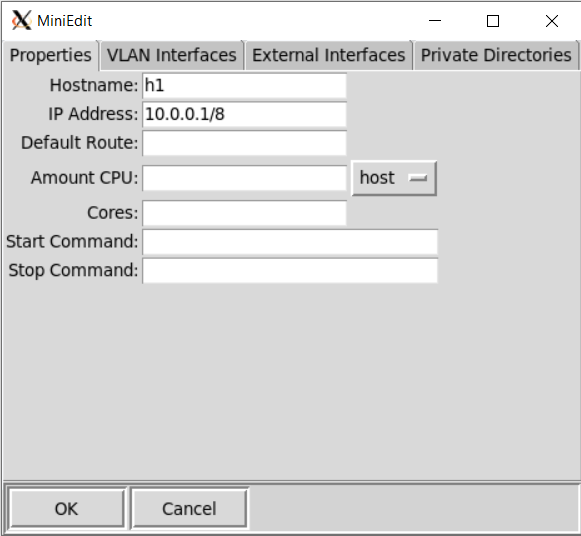{#fig:023 width=70%}

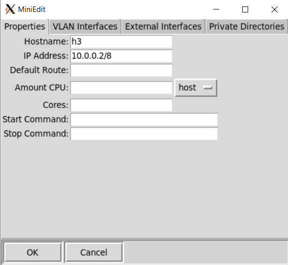{#fig:024 width=70%}

Запустим эмуляцию, нажав на кнопку Run (рис. [-@fig:025]):

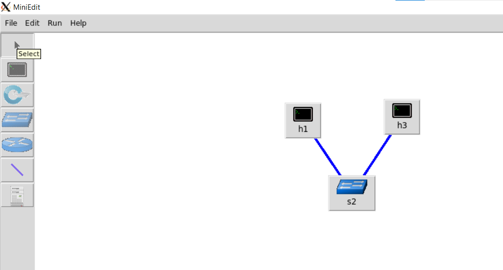{#fig:025 width=70%}

Откроем терминалы на обоих хостах и введем команду ifconfig, чтобы отобразить назначенные IP-адреса. Проверим соединение между хостами, введя в терминале хоста h1 команду ping 10.0.0.2 (рис. [-@fig:026]). 

{#fig:026 width=70%}

Настроим автоматическое назначение IP-адресов. Для этого в MiniEdit нажмет Edit>Preferences. По умолчанию в поле базовые значения IP-адресов установлено 10.0.0.0/8. Изменим это значение на 15.0.0.0/8 (рис. [-@fig:027]). 

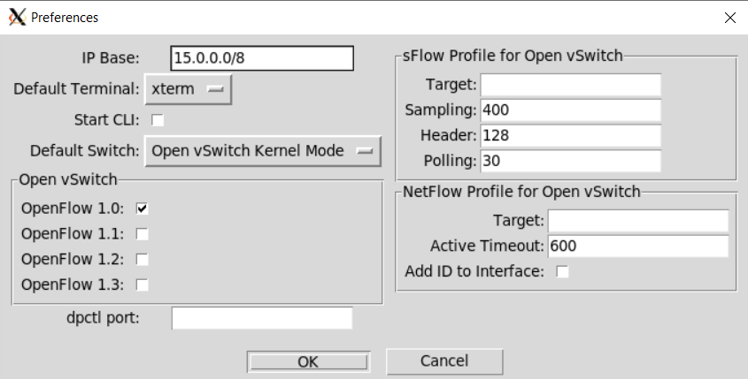{#fig:027 width=70%}

Вновь запустим эмуляцию, откроем терминалы и введем команды ifconfig. Проверим соединение между хостами (рис. [-@fig:028]).

{#fig:028 width=70%}

В домашнем каталоге виртуальной машины mininet создайте каталог для работы с проектами mininet: `mkdir ~/work`. Cохраним топологию в созданную папку, нажав на File>Save (рис. [-@fig:029]). 

{#fig:029 width=70%}

После сохранения проекта поменяем права доступа к файлам в каталоге проекта.

# Выводы

В результате выполнения данной лабораторной работы я развёрнула mininet в системе виртуализации VirtualBox, а также ознакомилась с основными командами для работы с Mininet через командную строку и через графический интерфейс.
