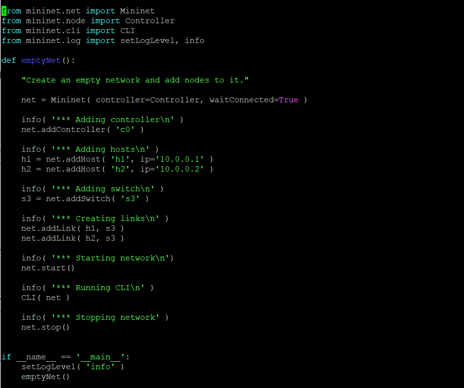
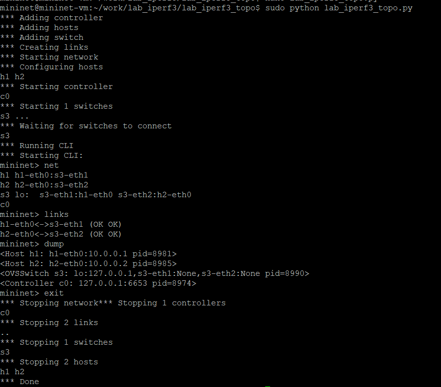
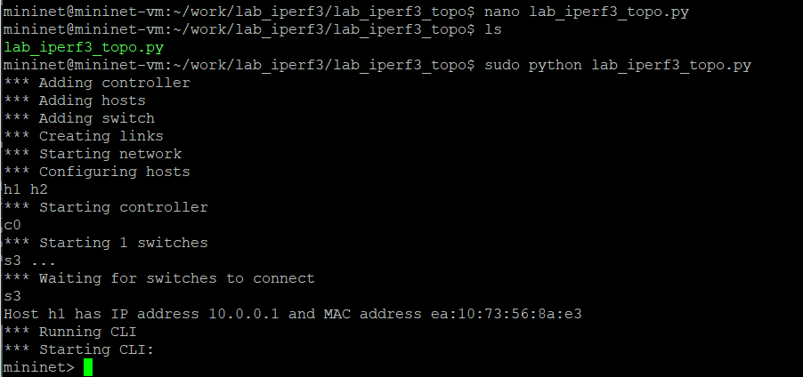
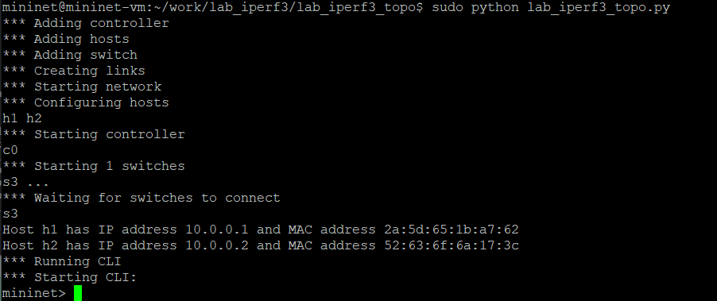
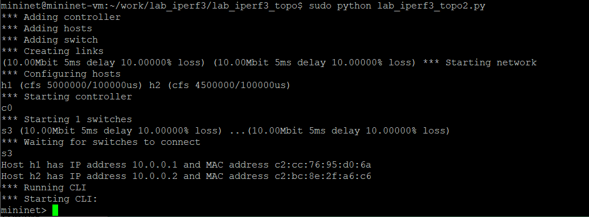
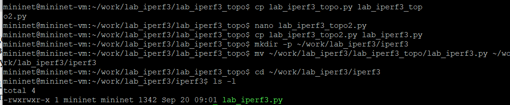
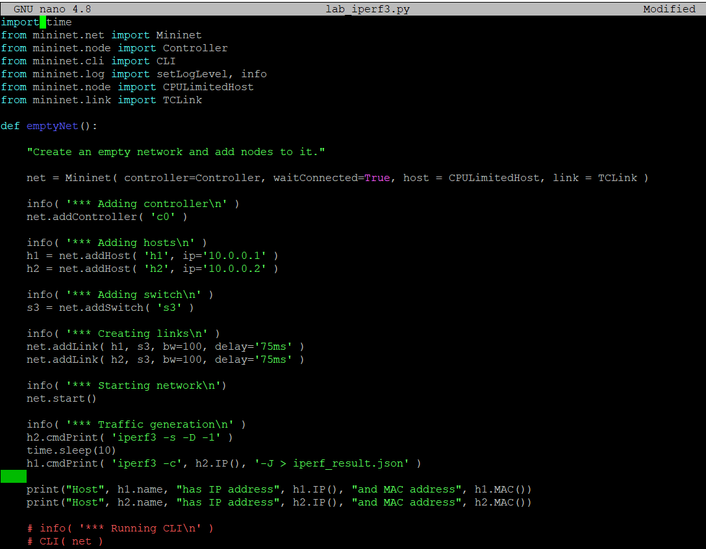
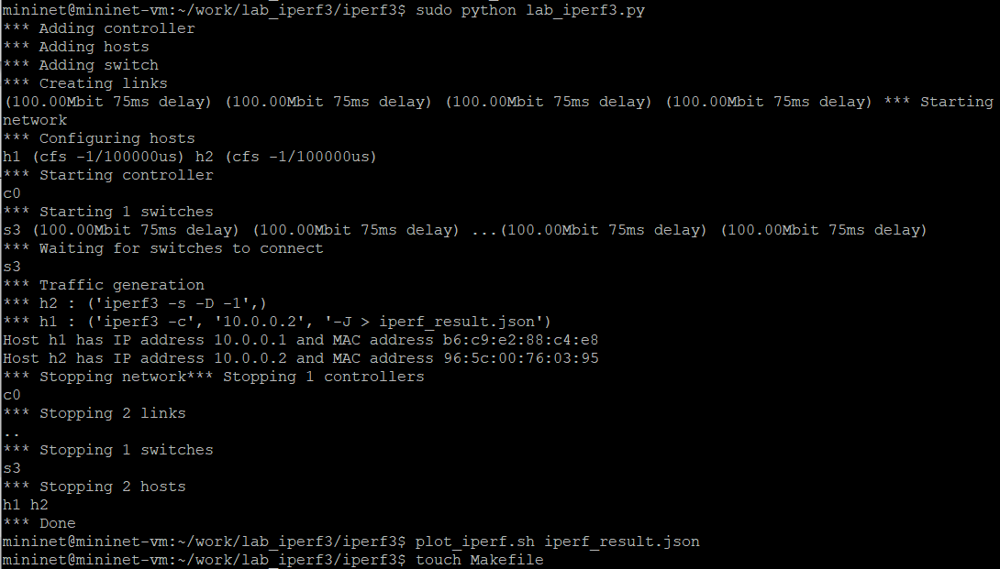

---
## Front matter
lang: ru-RU
title: Лабораторная работа 3
subtitle: Измерение и тестирование пропускной способности сети. Воспроизводимый эксперимент
author:
  - Ланцова Я. И.
institute:
  - Российский университет дружбы народов, Москва, Россия

## i18n babel
babel-lang: russian
babel-otherlangs: english

## Formatting pdf
toc: false
toc-title: Содержание
slide_level: 2
aspectratio: 169
section-titles: true
theme: metropolis
header-includes:
 - \metroset{progressbar=frametitle,sectionpage=progressbar,numbering=fraction}
 - '\makeatletter'
 - '\beamer@ignorenonframefalse'
 - '\makeatother'
---

# Информация

## Докладчик

:::::::::::::: {.columns align=center}
::: {.column width="70%"}

  * Ланцова Яна Игоревна
  * студентка
  * Российский университет дружбы народов

:::
::::::::::::::

## Цель работы

Основной целью работы является знакомство с инструментом для измерения пропускной способности сети в режиме реального времени — iPerf3, а также получение навыков проведения воспроизводимого эксперимента по измерению пропускной способности моделируемой сети в среде Mininet.

## Задачи

1. Воспроизвести посредством API Mininet эксперименты по измерению пропускной способности с помощью iPerf3.
2. Построить графики по проведённому эксперименту.

# Выполнение лабораторной работы

## Выполнение лабораторной работы

{#fig:001 width=60%}

## Выполнение лабораторной работы

{#fig:002 width=60%}

## Выполнение лабораторной работы

{#fig:003 width=50%}

## Выполнение лабораторной работы

{#fig:004 width=50%}

## Выполнение лабораторной работы

{#fig:005 width=50%}

## Выполнение лабораторной работы

{#fig:006 width=60%}

## Выполнение лабораторной работы

{#fig:007 width=50%}

## Выполнение лабораторной работы

{#fig:008 width=50%}

## Выполнение лабораторной работы

{#fig:009 width=50%}

## Выполнение лабораторной работы

{#fig:010 width=60%}

## Выполнение лабораторной работы

{#fig:011 width=50%}

## Выполнение лабораторной работы

{#fig:012 width=50%}

## Выполнение лабораторной работы

{#fig:013 width=60%}

## Выполнение лабораторной работы

{#fig:014 width=50%}

# Выводы

В результате выполнения данной лабораторной работы я познакомилась с инструментом для измерения пропускной способности сети в режиме реального времени — iPerf3, а также получила навыки проведения воспроизводимого эксперимента по измерению пропускной способности моделируемой сети в среде Mininet.
