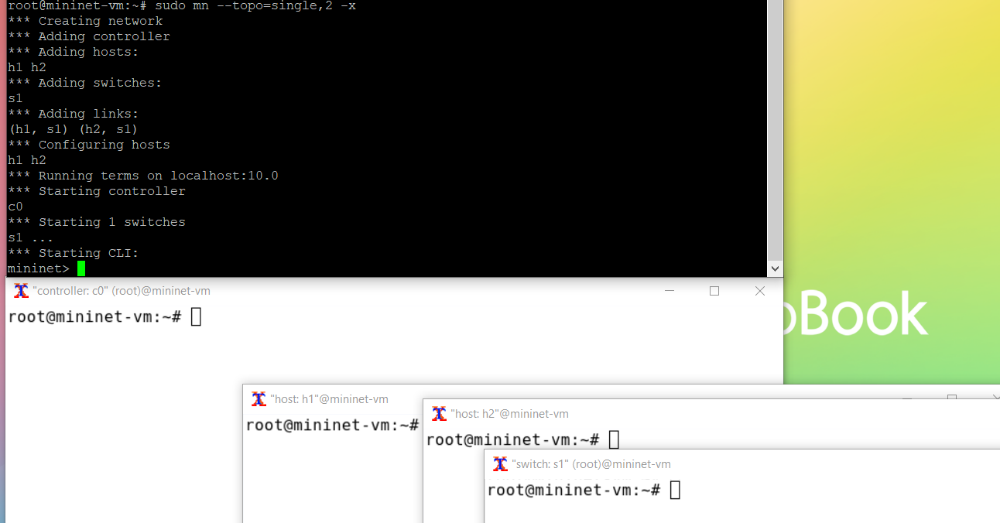
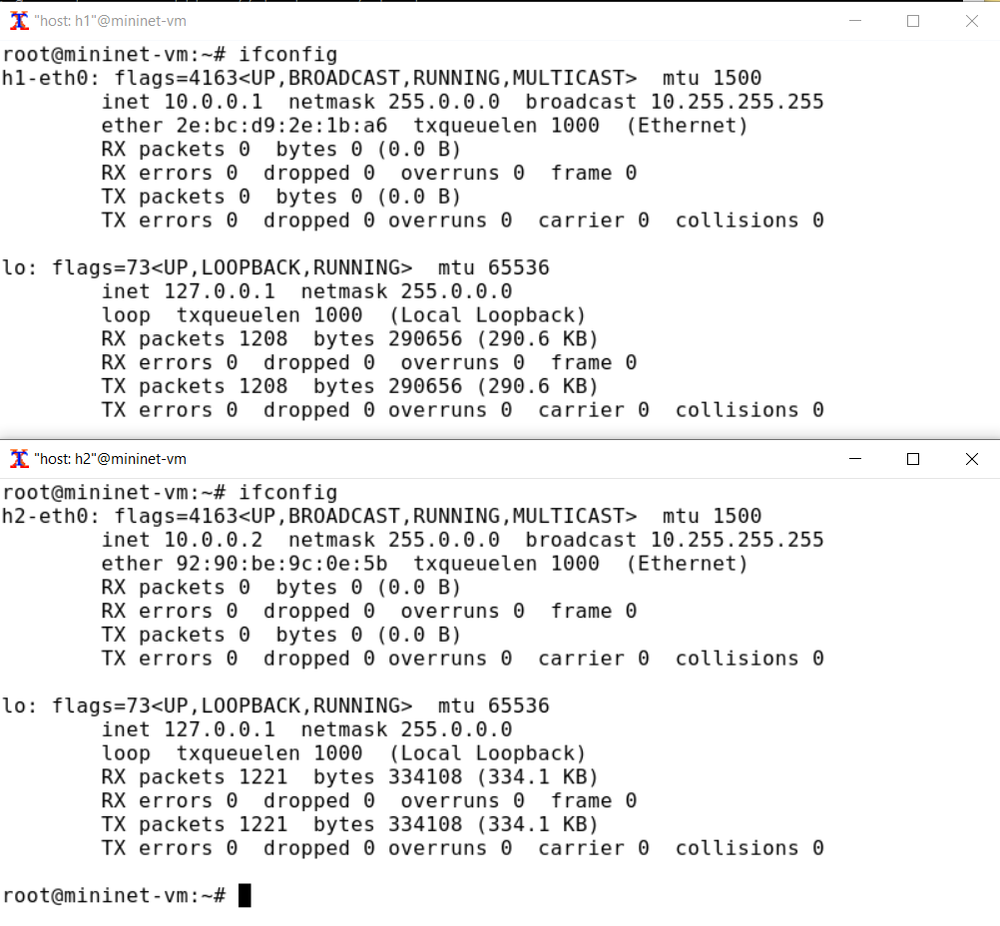
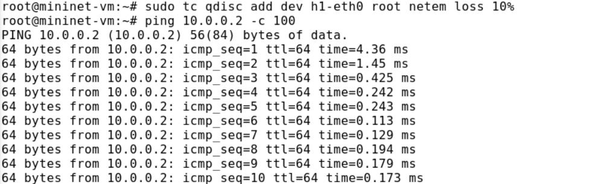
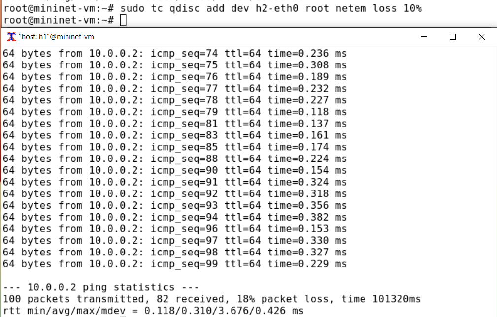
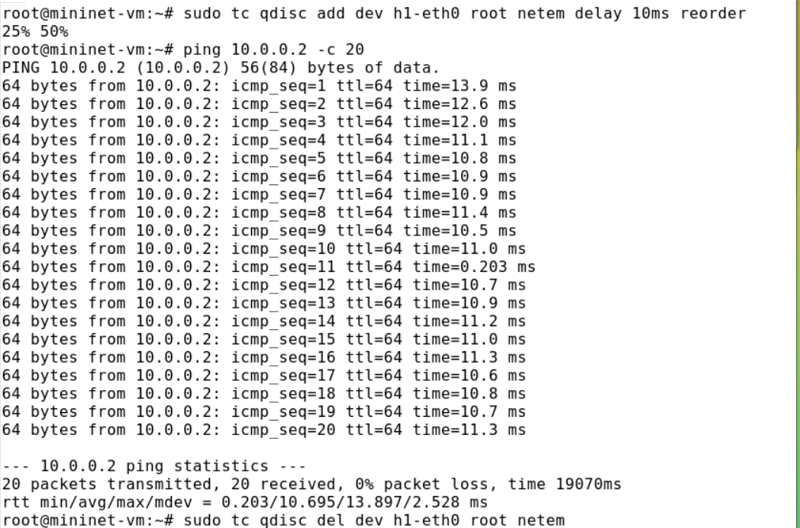
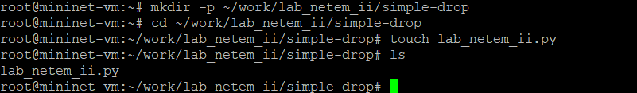
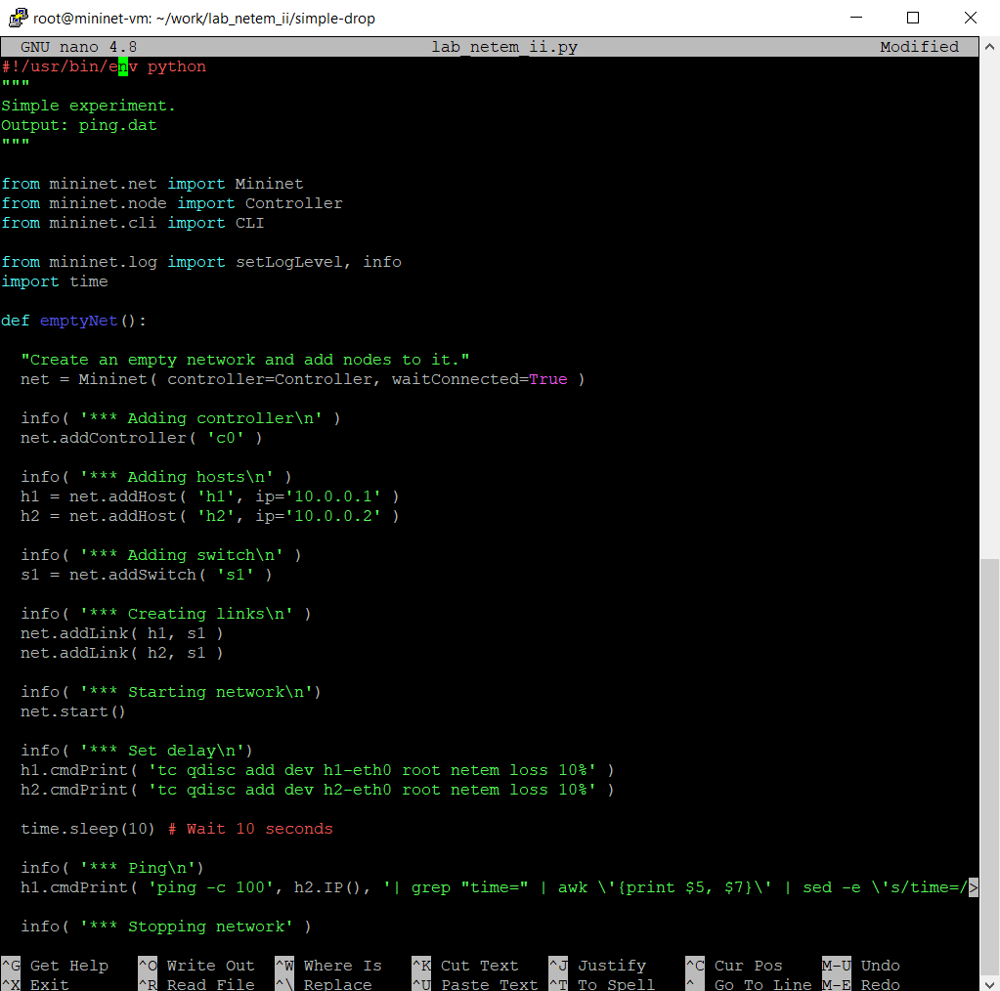
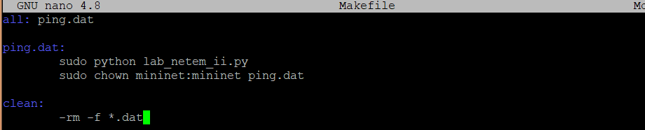
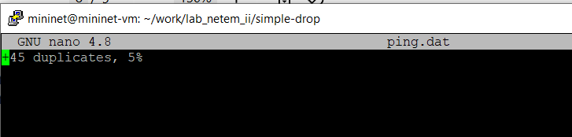

---
## Front matter
title: "Лабораторная работа №5"
subtitle: "Эмуляция и измерение потерь пакетов в глобальных сетях"
author: "Ланцова Яна Игоревна"

## Generic otions
lang: ru-RU
toc-title: "Содержание"

## Bibliography
bibliography: bib/cite.bib
csl: pandoc/csl/gost-r-7-0-5-2008-numeric.csl

## Pdf output format
toc: true # Table of contents
toc-depth: 2
lof: true # List of figures
lot: true # List of tables
fontsize: 12pt
linestretch: 1.5
papersize: a4
documentclass: scrreprt
## I18n polyglossia
polyglossia-lang:
  name: russian
  options:
    - spelling=modern
    - babelshorthands=true
polyglossia-otherlangs:
  name: english
## I18n babel
babel-lang: russian
babel-otherlangs: english
## Fonts
mainfont: IBM Plex Serif
romanfont: IBM Plex Serif
sansfont: IBM Plex Sans
monofont: IBM Plex Mono
mathfont: STIX Two Math
mainfontoptions: Ligatures=Common,Ligatures=TeX,Scale=0.94
romanfontoptions: Ligatures=Common,Ligatures=TeX,Scale=0.94
sansfontoptions: Ligatures=Common,Ligatures=TeX,Scale=MatchLowercase,Scale=0.94
monofontoptions: Scale=MatchLowercase,Scale=0.94,FakeStretch=0.9
mathfontoptions:
## Biblatex
biblatex: true
biblio-style: "gost-numeric"
biblatexoptions:
  - parentracker=true
  - backend=biber
  - hyperref=auto
  - language=auto
  - autolang=other*
  - citestyle=gost-numeric
## Pandoc-crossref LaTeX customization
figureTitle: "Рис."
tableTitle: "Таблица"
listingTitle: "Листинг"
lofTitle: "Список иллюстраций"
lotTitle: "Список таблиц"
lolTitle: "Листинги"
## Misc options
indent: true
header-includes:
  - \usepackage{indentfirst}
  - \usepackage{float} # keep figures where there are in the text
  - \floatplacement{figure}{H} # keep figures where there are in the text
---

# Цель работы

Основной целью работы является получение навыков проведения интерактивных экспериментов в среде Mininet по исследованию параметров сети, связанных с потерей, дублированием, изменением порядка и повреждением пакетов при передаче данных. Эти параметры влияют на производительность протоколов и сетей.

# Задачи

1. Задайте простейшую топологию, состоящую из двух хостов и коммутатора с назначенной по умолчанию mininet сетью 10.0.0.0/8.
2. Проведите интерактивные эксперименты по по исследованию параметров сети, связанных с потерей, дублированием, изменением порядка и повреждением пакетов при передаче данных.
3. Реализуйте воспроизводимый эксперимент по добавлению правила отбрасывания пакетов в эмулируемой глобальной сети. На экран выведите сводную информацию о потерянных пакетах.
4. Самостоятельно реализуйте воспроизводимые эксперименты по исследованию параметров сети, связанных с потерей, изменением порядка и повреждением пакетов при передаче данных. На экран выведите сводную информацию о потерянных пакетах.

# Выполнение лабораторной работы

## Запуск лабораторной топологии

Из основной ОС подключимся к виртуальной машине и в исправим права запуска X-соединения. Скопируем значение куки (MIT magic cookie) своего пользователя mininet в файл для пользователя root (рис. [-@fig:001]).

{#fig:001 width=70%}

Зададим простейшую топологию, состоящую из двух хостов и коммутатора с назначенной по умолчанию mininet сетью 10.0.0.0/8 (рис. [-@fig:002]). После введения этой команды запустятся терминалы двух хостов, коммутатора и контроллера. Терминалы коммутатора и контроллера можно закрыть.

{#fig:002 width=70%}

На хостах h1 и h2 введем команду ifconfig, чтобы отобразить информацию, относящуюся к их сетевым интерфейсам и назначенным им IP-адресам. В дальнейшем при работе с NETEM и командой tc будут использоваться интерфейсы h1-eth0 и h2-eth0(рис. [-@fig:003]). 

{#fig:003 width=70%}

Проверим подключение между хостами h1 и h2 с помощью команды ping с параметром -c 6  (рис. [-@fig:004]).

{#fig:004 width=70%}

##  Добавление потери пакетов на интерфейс, подключённый к эмулируемой глобальной сети

Пакеты могут быть потеряны в процессе передачи из-за таких факторов, как битовые ошибки и перегрузка сети. Скорость потери данных часто измеряется как процентная доля потерянных пакетов по отношению к количеству отправленных пакетов. На хосте h1 добавим 10% потерь пакетов к интерфейсу h1-eth0(рис. [-@fig:005]).

{#fig:005 width=70%}

Здесь:

- sudo: выполнить команду с более высокими привилегиями;
- tc: вызвать управление трафиком Linux;
- qdisc: изменить дисциплину очередей сетевого планировщика;
- add: создать новое правило;
- dev h1-eth0: указать интерфейс, на котором будет применяться правило;
- netem: использовать эмулятор сети;
- loss 10%: 10% потерь пакетов.

Проверим, что на соединении от хоста h1 к хосту h2 имеются потери пакетов, используя команду ping с параметром -c 100 с хоста h1. Параметр -c указывает общее количество пакетов для отправки. Обратите внимание на значения icmp_seq. Некоторые номера последовательности отсутствуют изза потери пакетов. В сводном отчёте ping сообщает о проценте потерянных пакетов после завершения передачи (рис. [-@fig:006]).

{#fig:006 width=70%}

Потеряно 4% пакетов.

Для эмуляции глобальной сети с потерей пакетов в обоих направлениях необходимо к соответствующему интерфейсу на хосте h2 также добавить 10% потерь пакетов. Проверим, что соединение между хостом h1 и хостом h2 имеет больший процент потерянных данных (10% от хоста h1 к хосту h2 и 10% от хоста h2 к хосту h1), повторив команду ping с параметром -c 100 на терминале хоста h1 (рис. [-@fig:007]).

{#fig:007 width=70%}

Потеряно 18% пакетов.

Восстановим конфигурацию по умолчанию, удалив все правила, применённые к сетевому планировщику соответствующего интерфейса. Для отправителяей h1 и h2 (рис. [-@fig:008]). Также убедимся, что соединение от хоста h1 к хосту h2 не имеет явной потери пакетов, запустив команду ping с терминала хоста h1.

{#fig:008 width=70%}

## Добавление значения корреляции для потери пакетов в эмулируемой глобальной сети

Добавим на интерфейсе узла h1 коэффициент потери пакетов 50% (такой высокий уровень потери пакетов маловероятен), и каждая последующая вероятность зависит на 50% от последней: Проверим, что на соединении от хоста h1 к хосту h2 имеются потери пакетов, используя команду ping с параметром -c 50 с хоста h1 (рис. [-@fig:009]).

{#fig:009 width=70%}

## Добавление повреждения пакетов в эмулируемой глобальной сети

Добавим на интерфейсе узла h1 0,01% повреждения пакетов с помощью команды `sudo tc qdisc add dev h1-eth0 root netem corrupt 0.01%`. Проверим конфигурацию с помощью инструмента iPerf3 для проверки повторных передач (рис. [-@fig:010]).

{#fig:010 width=70%}

Значения повторно переданных пакетов можно увидеть в колонке `Retr`. Общее число 3.

## Добавление переупорядочивания пакетов в интерфейс подключения к эмулируемой глобальной сети

Добавим на интерфейсе узла h1 следующее правило: 25% пакетов (со значением корреляции 50%) будут отправлены немедленно, а остальные 75% будут задержаны на 10 мс. Проверим, что на соединении от хоста h1 к хосту h2 имеются потери пакетов, используя команду ping с параметром -c 20 с хоста h1. Убедимся, что часть пакетов не будут иметь задержки (один из четырех, или 25%), а последующие несколько пакетов будут иметь задержку около 10 миллисекунд (три из четырех, или 75%) (рис. [-@fig:011]):

{#fig:011 width=70%}

## Добавление дублирования пакетов в интерфейс подключения к эмулируемой глобальной сети

Для интерфейса узла h1 зададим правило c дублированием 50% пакетов (т.е. 50% пакетов должны быть получены дважды). Проверим, что на соединении от хоста h1 к хосту h2 имеются дублированные пакеты, используя команду ping с параметром -c 20 с хоста h1. Дубликаты пакетов помечаются как DUP! (рис. [-@fig:012]).

{#fig:012 width=70%}

##  Воспроизведение экспериментов

Для каждого воспроизводимого эксперимента expname создадим свой каталог, в котором будут размещаться файлы эксперимента. В виртуальной среде mininet в своём рабочем каталоге с проектами создадим каталог simple-drop и перейдем в него (рис. [-@fig:013]).

{#fig:013 width=70%}

Создадим скрипт для эксперимента lab_netem_ii.py (рис. [-@fig:014]). В этом скрипте создается простейщая топология сети, затем с помощью комнанд, использованных нами ранее задается потеря в 10% для обоих хостов, после чего пингуется второй хост (100 сообщений отправляется), при этом из сообщений при пинге вытаскиваются номер сообщения и значение времени, которые записываются в файл с данными.

{#fig:014 width=70%}

Скорректируем скрипт так, чтобы на экран или в отдельный файл выводилась информация о потерях пакетов.

```
#!/usr/bin/env python
"""
Simple experiment.
Output: ping.dat
"""

from mininet.net import Mininet
from mininet.node import Controller
from mininet.cli import CLI

from mininet.log import setLogLevel, info
import time

def emptyNet():

  "Create an empty network and add nodes to it."
  net = Mininet( controller=Controller, waitConnected=True )

  info( '*** Adding controller\n' )
  net.addController( 'c0' )

  info( '*** Adding hosts\n' )
  h1 = net.addHost( 'h1', ip='10.0.0.1' )
  h2 = net.addHost( 'h2', ip='10.0.0.2' )
  info( '*** Adding switch\n' )
  s1 = net.addSwitch( 's1' )

  info( '*** Creating links\n' )
  net.addLink( h1, s1 )
  net.addLink( h2, s1 )

  info( '*** Starting network\n')
  net.start()

  info( '*** Set delay\n')
  h1.cmdPrint( 'tc qdisc add dev h1-eth0 root netem loss 10%' )
  h2.cmdPrint( 'tc qdisc add dev h2-eth0 root netem loss 10%' )

  time.sleep(10) # Wait 10 seconds

  info( '*** Ping\n')
  h1.cmdPrint('ping -c 100', h2.IP(), '| grep "packet loss" | awk \'{print $6, $7, $8}\')

  info( '*** Stopping network' )
  net.stop()

if __name__ == '__main__':
  setLogLevel( 'info' )
  emptyNet()
```

Создадим Makefile для управления процессом проведения эксперимента (рис. [-@fig:015]).

{#fig:015 width=70%}

Выполним эксперимент, написав команду make (рис. [-@fig:016]).

{#fig:016 width=70%}

##  Задание для самостоятельного выполнения

Самостоятельно реализуем воспроизводимые эксперименты по исследованию параметров сети, связанных с потерей, изменением порядка и повреждением пакетов при передаче данных (рис. [-@fig:017]).

{#fig:017 width=70%}

Выполним эксперимент, написав команду make (рис. [-@fig:018]).

{#fig:018 width=70%}

Посмотрим информацию, записанную в ping.dat (рис. [-@fig:019]).

{#fig:019 width=70%}

# Выводы

В результате выполнения данной лабораторной работы я получила навыки проведения интерактивных экспериментов в среде Mininet по исследованию параметров сети, связанных с потерей, дублированием, изменением порядка и повреждением пакетов при передаче данных.


