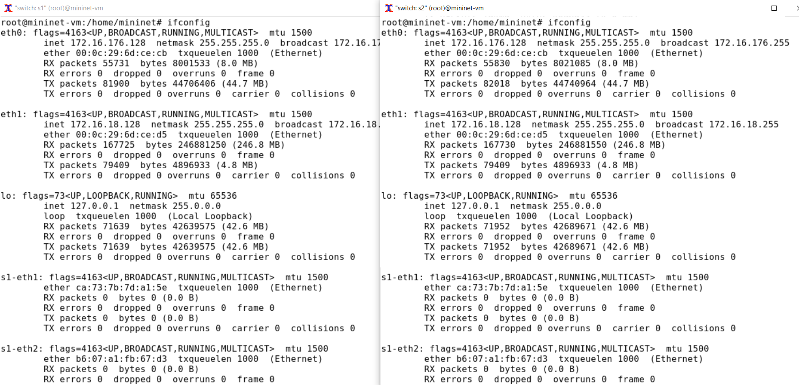
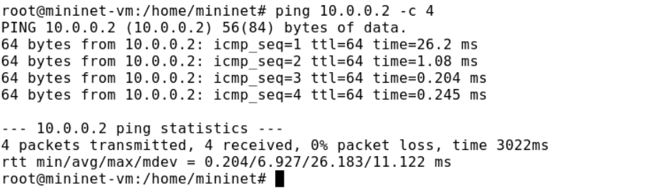
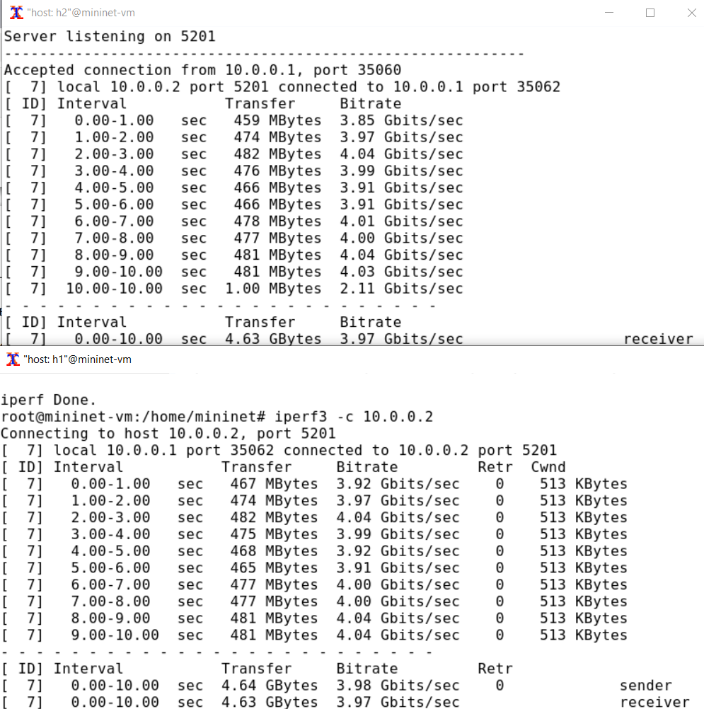
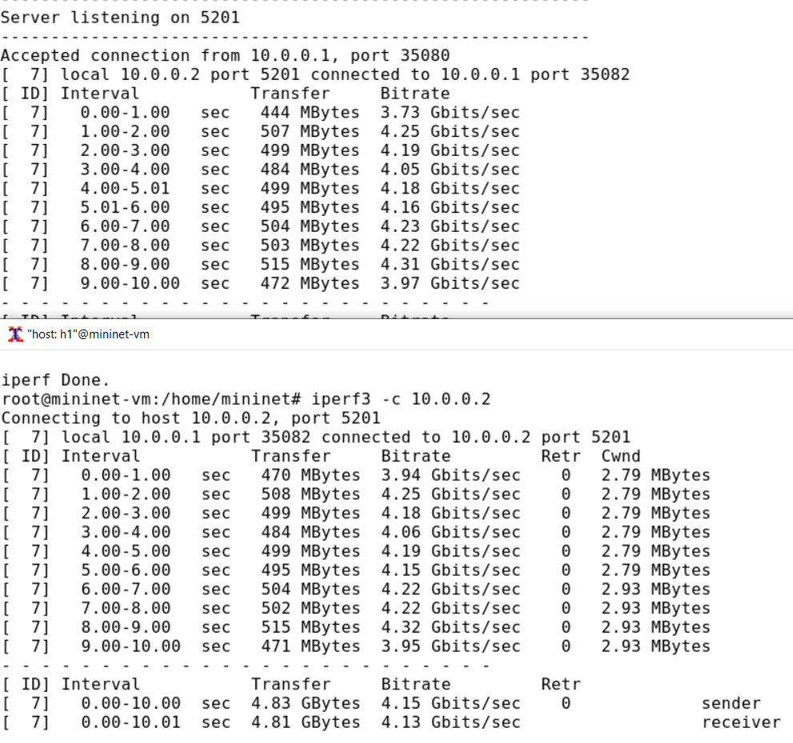
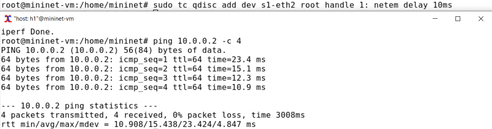
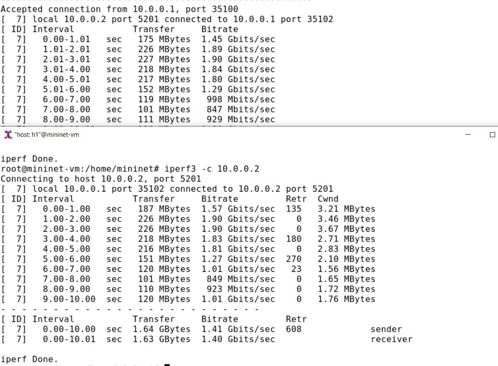
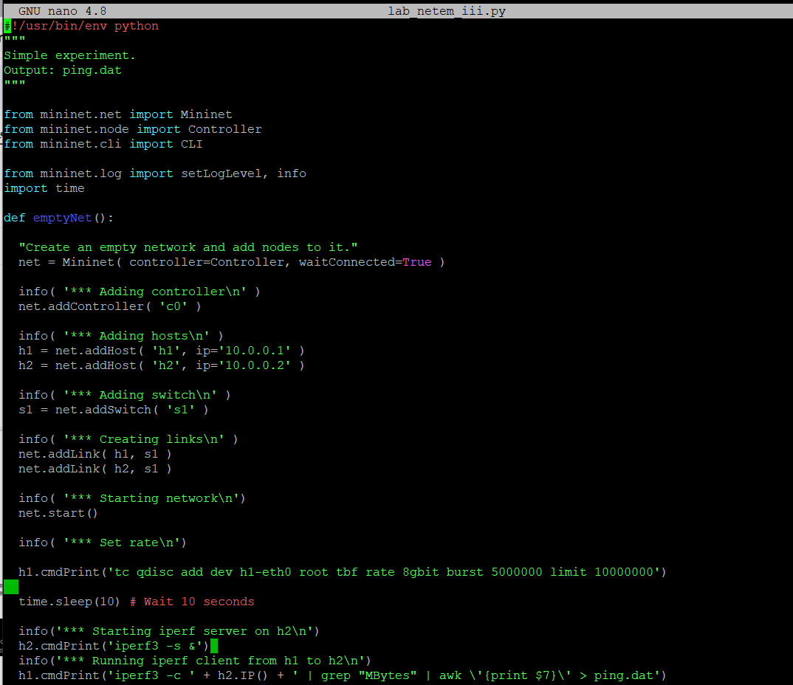
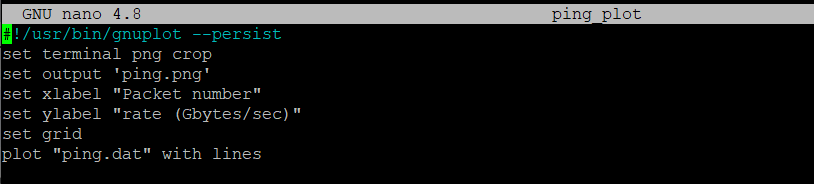

---
## Front matter
lang: ru-RU
title: Лабораторная работа 6
subtitle: Настройка пропускной способности глобальной сети с помощью Token Bucket Filter
author:
  - Ланцова Я. И.
institute:
  - Российский университет дружбы народов, Москва, Россия

## i18n babel
babel-lang: russian
babel-otherlangs: english

## Formatting pdf
toc: false
toc-title: Содержание
slide_level: 2
aspectratio: 169
section-titles: true
theme: metropolis
header-includes:
 - \metroset{progressbar=frametitle,sectionpage=progressbar,numbering=fraction}
 - '\makeatletter'
 - '\beamer@ignorenonframefalse'
 - '\makeatother'
---

# Информация

## Докладчик

:::::::::::::: {.columns align=center}
::: {.column width="70%"}

  * Ланцова Яна Игоревна
  * студентка
  * Российский университет дружбы народов

:::
::::::::::::::

## Цель работы

Основной целью работы является знакомство с принципами работы дисциплины очереди Token Bucket Filter, которая формирует входящий/исходящий трафик для ограничения пропускной способности, а также получение навыков моделирования и исследования поведения трафика посредством проведения интерактивного и воспроизводимого экспериментов в Mininet.

## Задачи

1. Задайте топологию, состоящую из двух хостов и двух коммутаторов с назначенной по умолчанию mininet сетью 10.0.0.0/8.
2. Проведите интерактивные эксперименты по ограничению пропускной способности сети с помощью TBF в эмулируемой глобальной сети.
3. Самостоятельно реализуйте воспроизводимые эксперимент по применению TBF для ограничения пропускной способности. Постройте соответствующие графики.

# Выполнение лабораторной работы

## Выполнение лабораторной работы

{#fig:001 width=60%}

## Выполнение лабораторной работы

{#fig:002 width=50%}

## Выполнение лабораторной работы

{#fig:003 width=40%}

## Выполнение лабораторной работы

{#fig:004 width=60%}

## Выполнение лабораторной работы

{#fig:005 width=60%}

## Выполнение лабораторной работы

{#fig:006 width=40%}

## Выполнение лабораторной работы

{#fig:007 width=60%}

## Выполнение лабораторной работы

{#fig:008 width=40%}

## Выполнение лабораторной работы

{#fig:009 width=40%}

## Выполнение лабораторной работы

{#fig:010 width=60%}

## Выполнение лабораторной работы

{#fig:011 width=40%}

## Выполнение лабораторной работы

{#fig:012 width=60%}

## Выполнение лабораторной работы

{#fig:013 width=40%}

## Выполнение лабораторной работы

{#fig:014 width=60%}

## Выполнение лабораторной работы

{#fig:015 width=60%}

## Выполнение лабораторной работы

{#fig:016 width=50%}

## Выполнение лабораторной работы

{#fig:017 width=50%}

# Выводы

В результате выполнения данной лабораторной работы я познакомилась с принципами работы дисциплины очереди Token Bucket Filter, которая формирует входящий/исходящий трафик для ограничения пропускной способности, а также получила навыки моделирования и исследования поведения трафика посредством проведения интерактивного и воспроизводимого экспериментов в Mininet.
