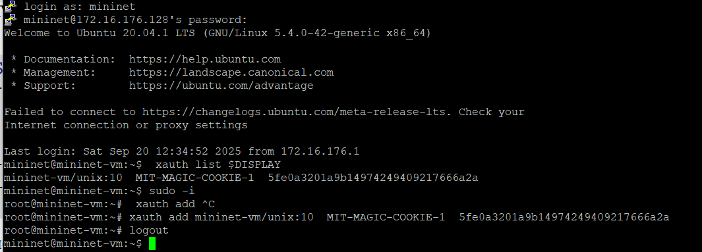
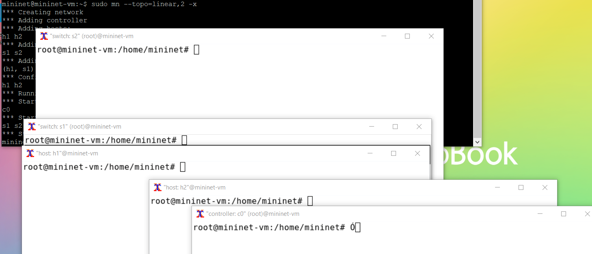
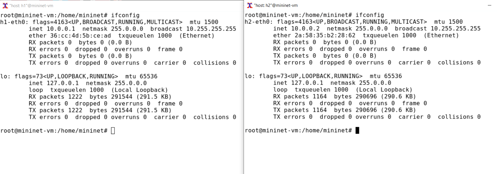
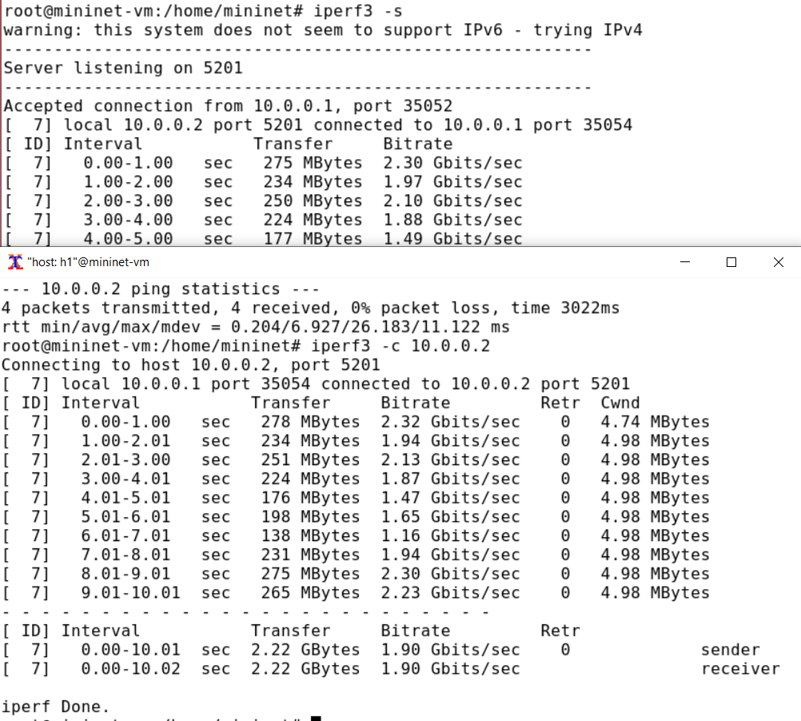
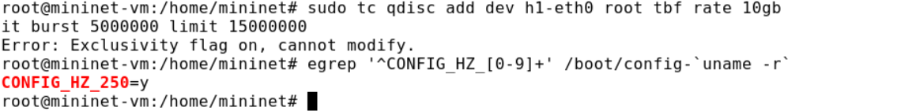
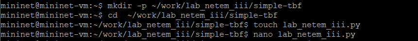
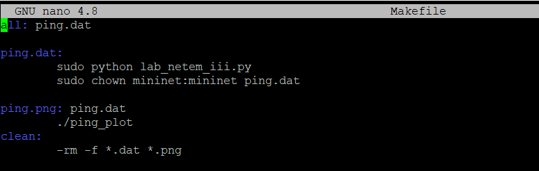
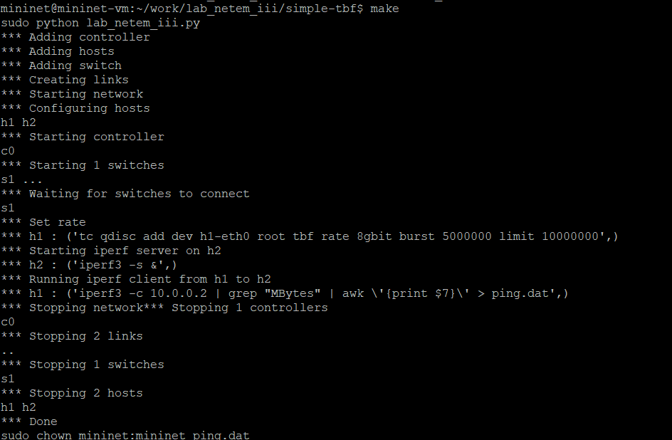
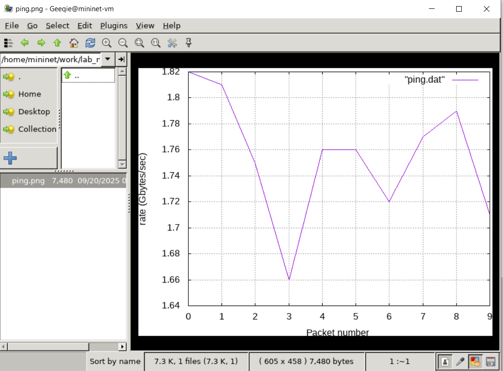

---
## Front matter
title: "Лабораторная работа №6"
subtitle: "Настройка пропускной способности глобальной сети с помощью Token Bucket Filter"
author: "Ланцова Яна Игоревна"

## Generic otions
lang: ru-RU
toc-title: "Содержание"

## Bibliography
bibliography: bib/cite.bib
csl: pandoc/csl/gost-r-7-0-5-2008-numeric.csl

## Pdf output format
toc: true # Table of contents
toc-depth: 2
lof: true # List of figures
lot: true # List of tables
fontsize: 12pt
linestretch: 1.5
papersize: a4
documentclass: scrreprt
## I18n polyglossia
polyglossia-lang:
  name: russian
  options:
    - spelling=modern
    - babelshorthands=true
polyglossia-otherlangs:
  name: english
## I18n babel
babel-lang: russian
babel-otherlangs: english
## Fonts
mainfont: IBM Plex Serif
romanfont: IBM Plex Serif
sansfont: IBM Plex Sans
monofont: IBM Plex Mono
mathfont: STIX Two Math
mainfontoptions: Ligatures=Common,Ligatures=TeX,Scale=0.94
romanfontoptions: Ligatures=Common,Ligatures=TeX,Scale=0.94
sansfontoptions: Ligatures=Common,Ligatures=TeX,Scale=MatchLowercase,Scale=0.94
monofontoptions: Scale=MatchLowercase,Scale=0.94,FakeStretch=0.9
mathfontoptions:
## Biblatex
biblatex: true
biblio-style: "gost-numeric"
biblatexoptions:
  - parentracker=true
  - backend=biber
  - hyperref=auto
  - language=auto
  - autolang=other*
  - citestyle=gost-numeric
## Pandoc-crossref LaTeX customization
figureTitle: "Рис."
tableTitle: "Таблица"
listingTitle: "Листинг"
lofTitle: "Список иллюстраций"
lotTitle: "Список таблиц"
lolTitle: "Листинги"
## Misc options
indent: true
header-includes:
  - \usepackage{indentfirst}
  - \usepackage{float} # keep figures where there are in the text
  - \floatplacement{figure}{H} # keep figures where there are in the text
---

# Цель работы

Основной целью работы является знакомство с принципами работы дисциплины очереди Token Bucket Filter, которая формирует входящий/исходящий трафик для ограничения пропускной способности, а также получение навыков моделирования и исследования поведения трафика посредством проведения интерактивного и воспроизводимого экспериментов в Mininet.

# Задачи

1. Задайте топологию, состоящую из двух хостов и двух коммутаторов с назначенной по умолчанию mininet сетью 10.0.0.0/8.
2. Проведите интерактивные эксперименты по ограничению пропускной способности сети с помощью TBF в эмулируемой глобальной сети.
3. Самостоятельно реализуйте воспроизводимые эксперимент по применению TBF для ограничения пропускной способности. Постройте соответствующие графики.

# Выполнение лабораторной работы

## Запуск лабораторной топологии

Из основной ОС подключимся к виртуальной машине и в исправим права запуска X-соединения. Скопируем значение куки (MIT magic cookie) своего пользователя mininet в файл для пользователя root (рис. [-@fig:001]).

{#fig:001 width=70%}

Зададим простейшую топологию, состоящую из двух хостов и коммутатора с назначенной по умолчанию mininet сетью 10.0.0.0/8 (рис. [-@fig:002]). После введения этой команды запустятся терминалы двух хостов, коммутатора и контроллера. Терминалы коммутатора и контроллера можно закрыть.

{#fig:002 width=70%}

На комммутаторах s1 и s2 введем команду ifconfig, чтобы отобразить информацию, относящуюся к их сетевым интерфейсам и назначенным им IP-адресам. В дальнейшем при работе с NETEM и командой tc будут использоваться интерфейсы s1-eth2 (рис. [-@fig:003]). 

{#fig:003 width=70%}

На хостах h1 и h2 введем команду ifconfig, чтобы отобразить информацию, относящуюся к их сетевым интерфейсам и назначенным им IP-адресам. В дальнейшем при работе с NETEM и командой tc будут использоваться интерфейсы h1-eth0 и h2-eth0 (рис. [-@fig:004]).

{#fig:004 width=70%}

Проверим подключение между хостами h1 и h2 с помощью команды ping с параметром -c 4 (рис. [-@fig:005]).

{#fig:005 width=70%}

Запустим iPerf3 на хостах и посмотрим результат отработки на данном этапе (рис. [-@fig:006]).

{#fig:006 width=70%}

## Интерактивные эксперименты

Изменим пропускную способность хоста h1, установив пропускную способность на 10 Гбит/с на интерфейсе h1-eth0 и параметры TBF-фильтра (рис. [-@fig:007]).

{#fig:007 width=70%}

Убедимся, что пропускная способность (Bitrate) увеличится (рис. [-@fig:008])

{#fig:008 width=70%}

Удалим модифицированную конфигурацию на хосте h1.

Применим правило ограничения скорости tbf с параметрами rate = 10gbit, burst = 5,000,000, limit= 15,000,000 к интерфейсу s1-eth2 коммутатора s1, который соединяет его с коммутатором s2 (рис. [-@fig:009]). Проверим примененные ограничения

{#fig:009 width=70%}

Удалим модифицированную конфигурацию на коммутаторе s1.

Объединим NETEM и TBF, введя на интерфейсе s1-eth2 коммутатора s1 задержку, джиттер, повреждение пакетов и указав скорость. Убедимся, что соединение от хоста h1 к хосту h2 имеет заданную задержку. Для этого запустим команду ping с параметром -c 4 с терминала хоста h1. (рис. [-@fig:010]).

{#fig:010 width=70%}

Добавим второе правило на коммутаторе s1, которое задаёт ограничение скорости с помощью tbf с параметрами rate=2gbit, burst=1,000,000, limit=2,000,000: и проверим внесенные изменения с помощью iPerf3 (рис. [-@fig:011]):

{#fig:011 width=70%}

Удалим модифицированную конфигурацию на коммутаторе s1.

## Воспроизводимые эксперименты

Самостоятельно реализуем воспроизводимые эксперименты по использованию TBF для ограничения пропускной способности. Для этого создадим рабочий каталог и файл со скриптом lab_netem_iii.py (рис. [-@fig:012]).

{#fig:012 width=70%}

Создадим скрипт для эксперимента lab_netem_iii.py. В этом скрипте создается простейщая топология сети, затем с помощью комнанд, использованных нами ранее изменяется пропускная способность для первого хоста, после чего пингуется второй хост (100 сообщений отправляется), при этом из сообщений при пинге вытаскиваются номер сообщения и значение времени, которые записываются в файл с данными. (рис. [-@fig:013]).

{#fig:013 width=70%}

Создадим Makefile для управления процессом проведения эксперимента и записи данных в файл(рис. [-@fig:014]). 

{#fig:014 width=70%}

Создадим файл ping_plot для отображения данных (рис. [-@fig:015]).

{#fig:015 width=70%}

Выполним эксперимент, написав команду make (рис. [-@fig:016]).

{#fig:016 width=70%}

Изучим созданный график (рис. [-@fig:017]).

{#fig:017 width=70%}

# Выводы

В результате выполнения данной лабораторной работы я познакомилась с принципами работы дисциплины очереди Token Bucket Filter, которая формирует входящий/исходящий трафик для ограничения пропускной способности, а также получила навыки моделирования и исследования поведения трафика посредством проведения интерактивного и воспроизводимого экспериментов в Mininet.

